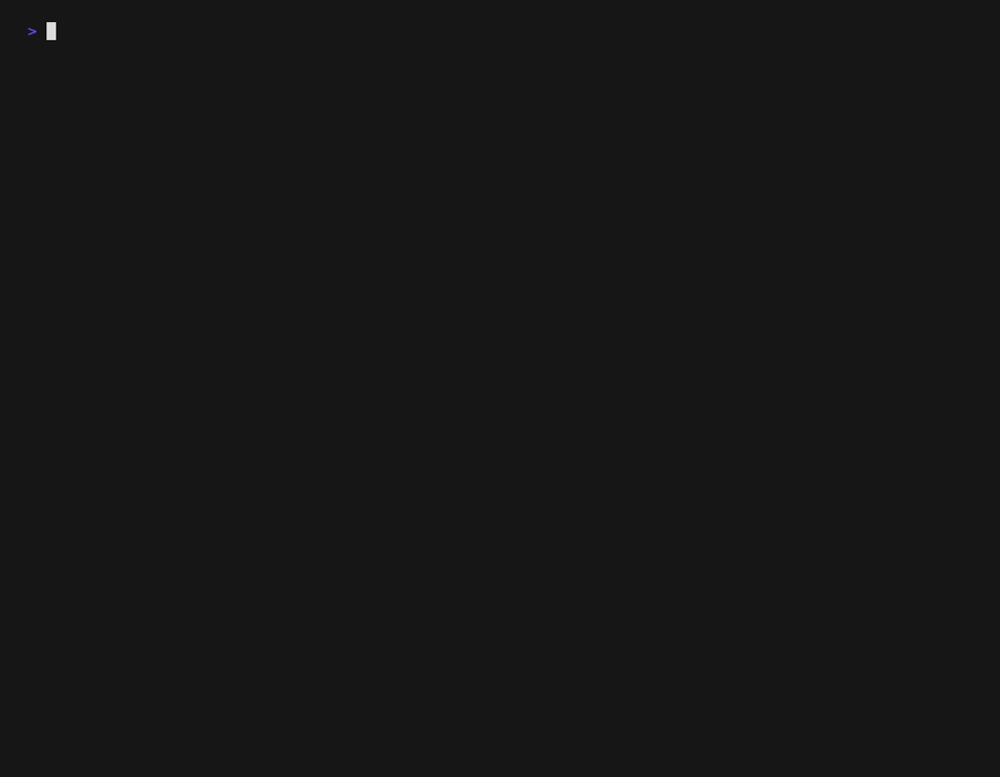

# offgrid-vision

Analyze images with a local multimodal model instead of spending cloud multimodal tokens.

`offgrid-vision` is a zero-dependency Node.js CLI that sends images to [Ollama](https://ollama.com)
running on your own machine and returns compact structured JSON. It is built to be
called by agent harnesses — and it can install an Agent Skill so a harness knows to
reach for it automatically.



## Why local

| | Cloud multimodal LLM | offgrid-vision |
|---|---|---|
| Cost per image | Thousands of tokens, billed | Free after the model download |
| Latency | Network round trip | Local inference |
| Privacy | The image leaves your machine | The image never leaves your machine |
| Offline | No | Yes |

An agent that reads ten screenshots in a session can spend tens of thousands of
multimodal tokens doing it. Delegating to a local model turns that into a few
hundred tokens of JSON.

## Prerequisites

- **Node.js 20 or newer**
- **[Ollama](https://ollama.com/download)** installed and running
- A vision model pulled. Pick the one that matches your RAM:

  | Total RAM | Model | Download |
  |---|---|---|
  | under 8 GB | `qwen3.5:2b` | 2.7 GB |
  | 8–24 GB | `qwen3.5:4b` (default) | 3.4 GB |
  | 24 GB or more | `gemma4:12b` | 7.6 GB |

  ```bash
  ollama pull qwen3.5:4b
  ```

  Not sure? Run `npx offgrid-vision doctor` — it detects your RAM and names the
  model to use.

Verify everything at once:

```bash
npx offgrid-vision doctor
```

## Quick start

```bash
# Human-readable
npx offgrid-vision analyze screenshot.png

# Machine-readable — this is what agents should use
npx offgrid-vision analyze screenshot.png --json

# A whole directory, four at a time
npx offgrid-vision analyze ./screenshots --json --concurrency 4

# Pull the text out of a receipt
npx offgrid-vision analyze receipt.jpg --json --mode ocr
```

Supported formats: PNG, JPEG, WebP, GIF (first frame), BMP, TIFF. Format is
detected from file contents, not the extension.

## Commands

### `analyze <path...>`

Analyze one or more images. Paths may be files or directories.

| Flag | Default | Description |
|---|---|---|
| `--json` | off | Emit JSON on stdout: an object for one file, an array for many |
| `--out <file>` | — | Write `{ results, summary }` JSON to a file |
| `--mode <preset>` | `general` | `general`, `ocr`, `alt-text`, or `ui` |
| `--prompt <text>` | — | Extra focus instruction; the schema is unchanged |
| `--model <name>` | `qwen3.5:4b` | Model to use |
| `--host <url>` | `http://localhost:11434` | Ollama host |
| `--timeout <ms>` | `120000` | Per-file deadline |
| `--concurrency <n>` | `1` | Files in flight at once, 1–4 |
| `--no-recursive` | off | Do not descend into subdirectories |

**Modes:**

- `general` — balanced description, objects, text, tags
- `ocr` — verbatim text extraction is the priority
- `alt-text` — one short accessibility sentence
- `ui` — screenshots: layout, controls, error and empty states

### `doctor`

Checks the Node version, total system RAM, Ollama reachability, and whether the
model is pulled. The memory check is advisory — it reports how much RAM this
machine has and which model is sized for it, but never fails. Prints exact
remediation on failure. Exits 0 when healthy, 3 otherwise, so scripts can gate
on it.

```bash
npx offgrid-vision doctor && npx offgrid-vision analyze shot.png --json
```

### `install-skill` / `uninstall-skill`

Install the Agent Skill so a harness delegates image work to this CLI.

```bash
npx offgrid-vision install-skill --harness claude-code --scope project
npx offgrid-vision install-skill --harness claude-code --scope user
npx offgrid-vision install-skill --harness generic --dir ~/my-harness/skills
```

With no flags it detects an existing `.claude` directory — project-local first,
then your home directory — and installs there. Re-running updates in place.
`uninstall-skill` takes the same flags and removes exactly the directory the
installer created.

## Output schema

This schema is a public contract; changes to it are semver-major.

```json
{
  "file": "/abs/path/screenshots/error.png",
  "model": "qwen3.5:4b",
  "duration_ms": 8421,
  "analysis": {
    "description": "A desktop application showing a modal error dialog.",
    "objects": [
      { "name": "error dialog", "confidence": "high" },
      { "name": "close button", "confidence": "medium" }
    ],
    "text": "Error: connection refused (code 111)",
    "tags": ["screenshot", "error-dialog", "desktop-app"]
  },
  "metadata": {
    "bytes": 148223,
    "format": "png",
    "width": 1280,
    "height": 800,
    "sha256": "9f2c…",
    "analyzed_at": "2026-07-21T10:15:00.000Z"
  },
  "error": null
}
```

A failed file uses the same envelope with `analysis: null` and a populated
`error`:

| Code | Meaning |
|---|---|
| `TIMEOUT` | Inference exceeded the per-file deadline |
| `PARSE_ERROR` | Model output was not valid JSON even after a repair attempt; the raw reply is in `analysis.raw` |
| `BACKEND_UNAVAILABLE` | Ollama unreachable, or the model is not installed |
| `UNSUPPORTED_FORMAT` | Not a supported image, judged by content |
| `IO_ERROR` | The file could not be read |

`--out` writes `{ "results": [...], "summary": { "total", "ok", "failed", "model", "duration_ms" } }`.

**Exit codes:** `0` success · `1` one or more files failed · `2` usage error · `3` backend unavailable.

## Using it from an agent

The installed skill teaches all of this, but the rules are short enough to state directly:

1. Run `doctor` once per session before the first analysis; surface its
   remediation to the user rather than silently falling back.
2. Always pass `--json` and read **stdout**. Progress goes to stderr; stdout is
   exclusively the payload.
3. Batch multiple images into one invocation rather than one call per image.
4. Check `error` on every element — a batch continues past individual failures.
5. If `analysis.parse_error` is true, the local model returned unstructured
   text; it is preserved in `analysis.raw`.

## Configuration

Flags beat environment variables, which beat defaults.

| Variable | Default |
|---|---|
| `OFFGRID_MODEL` | `qwen3.5:4b` |
| `OLLAMA_HOST` | `http://localhost:11434` |
| `OFFGRID_TIMEOUT` | `120000` |

## Privacy

No telemetry. The only network traffic is to the Ollama host you configure (and
to npm during `npx` bootstrap). If the host is not a loopback address, a warning
is printed to stderr, because at that point your images are leaving the machine.

## Development

```bash
npm install
npm test          # unit + integration, no live model needed
npm run typecheck
npm run build
```

Tests run against a mock Ollama HTTP server in `test/helpers/mock-ollama.ts`.

## License

MIT
